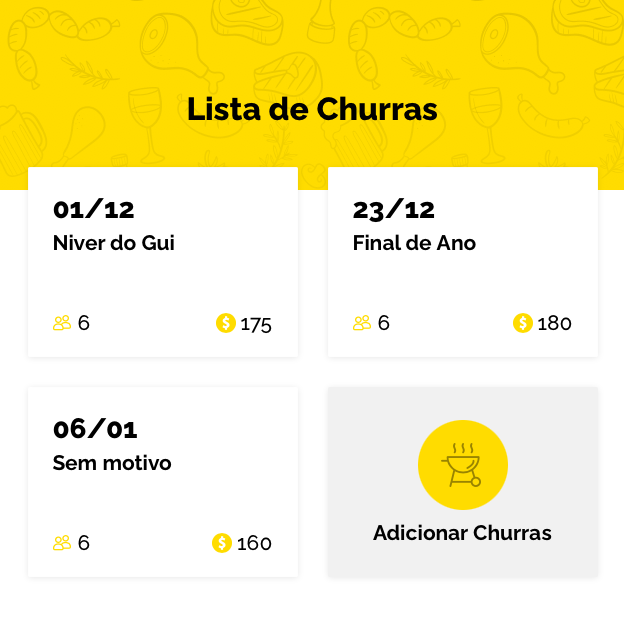

# The Churras

## What's it?
This's a Next/TypeScript Project that simulates a barbecue schedule.

## Main concepts:
SSR, Docker, Stitches, Unit Tests (Jest), REST, Services and Components.

## Sample view: 

## Live Demo:
* https://the-churras.vercel.app

## Requirements:
1. `Only Docker Desktop`

## Running the project (locally):

1. `cd the-churras`
2. `docker-compose build (only in the first time)`
3. `docker-compose up`